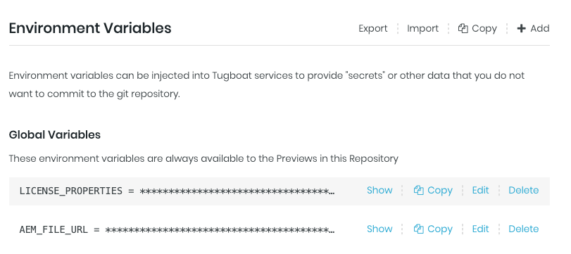

# Adobe Experience Manager Template for Tugboat

This is a configuration file for building live previews of AEM on [Tugboat CI](https://tugboat.ci) for every pull or merge request.

## Prerequisites

1. An account on [Tugboat.ci](https://tugboat.ci). The free tier most likely won't have enough RAM to run AEM. Instead, request a trial of at least a "Plus" tier.
2. A copy (JAR file) of AEM and a license. See [here](https://experienceleague.adobe.com/docs/experience-manager-65/deploying/deploying/deploy.html?lang=en#advanced-deployment) for details. 

## Installation

### Environment Variables

After your Tugboat account is created and wired up to a new repos or a forked version of this repos, it's time to set up the necessary environment variables. We'll be creating two variables. The first one is `LICENSE_PROPERTIES` followed by `AEM_FILE_URL`.



#### LICENSE_PROPERTIES

LICENSE_PROPERTIES is a base64 encoded version of the `license.properties` file. That text file will look something like this:

```
license.downloadID=unique-string
license.customer.name=your-name
```

To enocde the file, run: `bas64 ./license.properties > license64.properties`

Now, take the contents of `license64.properties` and add that as the value of the LICENSE_PROPERTIES environment variable. 

#### AEM_FILE_URL

AEM_FILE_URL is the private URL for Tugboat download the JAR file you've been authorized to use. The file name will likely be something like "AEM_6.5_Quickstart.jar". 

## Wrapping Up

The Preview takes some time to build, but once it's done you can hit new site and login using the default credentials of admin:admin. 

That's it. For more information check out the [Tugboat documentation](https://docs.tugboat.qa) to see what else you can do. If you have any questions, feel free to [reach out on Slack](https://launchpass.com/tugboatqa). 
